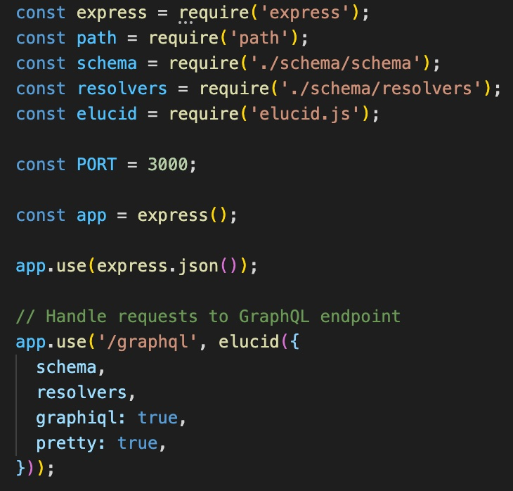

# Elucid

Elucid: Added Insight for GraphQL.

Accelerated by [OS Labs](https://github.com/oslabs-beta/) and developed by [Khayal Alasgarov](https://github.com/Alasgaroff), [Vivian Wu](https://github.com/vw-in-github), [Spencer Szu](https://github.com/Szuay), and [Giovanni Iacobucci](https://github.com/garyiacobucci).

## Features

- Extensible error detection and messaging for common graphQL issues deriving from server problems and bad queries.

## Installation

Elucid can be installed an an npm package:

- Download Elucid from npm in your terminal with `npm i elucid.js`

### Installing and connecting with Express:

In its current form, Elucid extends express-graphql's server middleware, so you'll need your GraphQL HTTP server setup running Express (or a similar web framework that supports connect styled middleware, such as Connect or Restify) as a prerequisite. Please see the [express-graphql documentation](https://github.com/graphql/express-graphql/blob/main/README.md) for more information on how to use the express-graphql route handler.

### Usage notes

- Currently, Elucid adds additional insight and status code manipulation for queries, but not mutations.

## Getting started with Elucid

Here's an example of a typical server.js setup running Elucid: 

</img>

- Notice that after installation of its npm package, the Elucid function must be imported into your server file as a required module, 'elucid.js'.
- Then, the elucid function is passed into the Express 'use' method as its second argument.
- This is very similar to how express-graphql's 'graphqlHTTP' middleware function is used. In fact, the configuration object that elucid() takes as an argument passes its values through to an invocation of graphqlHTTP. That includes the keys 'schema' and 'resolvers' (note that these evaluate to your imported GraphQL schema and resolver files), as well as the config booleans 'graphiql' and 'pretty'.
- At runtime, elucid() will kick off a sequence of events under the hood. GraphqlHTTP will process the request. If it doesn't catch an error on its own, Elucid's functionality will kick in to do its additional post-processing, which may include modifying the default response status code and returning a more detailed, useful context message in the 'elucid' property of the response object.

### Contribute to Elucid

Interested in making a contribution to Elucid? [Click](./CONTRIBUTING.md) for our open-source contribution guidelines.

Happy bug hunting/data fetching!
Team Elucid